# 大学生就业帮扶系统功能结构图

```mermaid
graph TD
    A[大学生就业帮扶系统] --> B[用户认证与档案管理]
    A --> C[就业招聘]
    A --> D[沟通交流]
    A --> E[企业评价]
    A --> F[辅导员工作台]

    %% 用户认证与档案管理模块
    B --> B1[用户注册]
    B --> B2[用户登录与身份验证]
    B --> B3[密码修改/找回]
    B --> B4[学生个人档案管理]
    B --> B5[企业档案管理]
    B --> B6[辅导员信息管理]

    %% 就业招聘模块
    C --> C1[企业岗位发布与管理]
    C --> C2[学生岗位浏览与筛选]
    C --> C3[学生简历投递]
    C --> C4[企业查看应聘申请]
    C --> C5[岗位申请状态流转]
    C --> C6[企业收藏/黑名单功能]
    C --> C7[辅导员岗位审核]

    %% 沟通交流模块
    D --> D1[企业与学生沟通]
    D --> D2[辅导员与学生交流]
    D --> D3[消息类型支持]
    D --> D4[会话管理与未读提醒]
    D --> D5[学生群组聊天]
    D5 -.-> D5X[未完成功能]

    %% 企业评价模块
    E --> E1[学生匿名评分]
    E --> E2[多维度评价]
    E --> E3[评价查看与管理]
    E --> E4[企业评分数据可视化]
    E4 -.-> E4X[未完成功能]

    %% 辅导员工作台模块
    F --> F1[企业认证审核]
    F --> F2[岗位信息审核]
    F --> F3[投诉举报处理]
    F --> F4[不当评价管理]
    F --> F5[操作日志记录]
    F --> F6[就业统计与报表]
    F6 -.-> F6X[未完成功能]

    %% 未完成的其他功能
    A --> G[需优化的功能]
    G --> G1[移动端适配优化]
    G --> G2[深色模式支持]
    G --> G3[界面主题定制]
    G --> G4[简历批量导出]
    G --> G5[系统安全与性能优化]
    G --> G6[第三方平台集成]
    G --> G7[行为分计算机制]

    %% 图例说明
    classDef default fill:#f9f9f9,stroke:#333,stroke-width:1px
    classDef completed fill:#d4edda,stroke:#28a745,stroke-width:1px
    classDef incomplete fill:#f8d7da,stroke:#dc3545,stroke-width:1px

    class B1,B2,B3,B4,B5,B6,C1,C2,C3,C4,C5,C6,C7,D1,D2,D3,D4,E1,E2,E3,F1,F2,F3,F4,F5 completed
    class D5,E4,F6,G1,G2,G3,G4,G5,G6,G7,D5X,E4X,F6X incomplete
```

## 功能模块说明

### 已完成功能

1. **用户认证与档案管理**

   - 支持学生/企业/辅导员三类用户注册登录
   - 完整的个人/企业信息管理功能
   - 密码找回与修改

2. **就业招聘**

   - 企业岗位发布与管理
   - 学生求职与简历投递
   - 完整的招聘流程管理

3. **沟通交流**

   - 企业与学生的招聘沟通
   - 辅导员与学生的指导交流
   - 支持文本、图片、文件消息

4. **企业评价**

   - 学生对企业的匿名评分
   - 多维度评价体系

5. **辅导员工作台**
   - 企业与岗位审核
   - 投诉举报处理
   - 完整的操作日志

### 未完成功能

1. **学生群组聊天**：数据库已设计但功能未实现
2. **企业评分数据可视化**：缺乏直观的图表展示
3. **就业统计与报表**：需要完善数据分析功能
4. **用户体验优化**：包括移动端适配、主题定制等
5. **系统性能与安全**：需加强并发处理和安全防护
