# 大学生就业帮扶系统角色功能结构图

```mermaid
graph TD
    A[大学生就业帮扶系统] --> B[学生]
    A --> C[企业]
    A --> D[辅导员]

    %% 学生角色功能
    B --> B1[个人档案管理]
    B1 --> B1A[基础信息维护]
    B1 --> B1B[教育经历管理]
    B1 --> B1C[项目经历管理]
    B1 --> B1D[技能标签设置]
    B1 --> B1E[简历文件上传]

    B --> B2[岗位搜索与申请]
    B2 --> B2A[岗位浏览与筛选]
    B2 --> B2B[岗位详情查看]
    B2 --> B2C[简历投递]
    B2 --> B2D[投递记录查看]
    B2 --> B2E[申请状态跟踪]

    B --> B3[沟通功能]
    B3 --> B3A[与企业HR聊天]
    B3 --> B3B[与辅导员交流]
    B3 --> B3C[群组聊天]
    B3C -.-> B3CX[未完成功能]

    B --> B4[企业评价]
    B4 --> B4A[匿名评分]
    B4 --> B4B[多维度评价提交]
    B4 --> B4C[查看其他学生评价]

    %% 企业角色功能
    C --> C1[企业档案管理]
    C1 --> C1A[企业信息维护]
    C1 --> C1B[资质认证申请]
    C1 --> C1C[认证状态查看]

    C --> C2[岗位招聘管理]
    C2 --> C2A[岗位发布与编辑]
    C2 --> C2B[招聘流程管理]
    C2 --> C2C[应聘申请处理]
    C2 --> C2D[简历查看与下载]

    C --> C3[沟通功能]
    C3 --> C3A[与求职学生交流]
    C3 --> C3B[与辅导员交流]

    C --> C4[收藏与黑名单]
    C4 --> C4A[学生收藏管理]
    C4 --> C4B[学生黑名单管理]

    C --> C5[评价查看]
    C5 --> C5A[学生评价浏览]
    C5 --> C5B[企业评分查看]

    %% 辅导员角色功能
    D --> D1[审核管理]
    D1 --> D1A[企业认证审核]
    D1 --> D1B[岗位信息审核]
    D1 --> D1C[自定义标签审核]

    D --> D2[学生管理]
    D2 --> D2A[学生档案查看]
    D2 --> D2B[就业情况跟踪]
    D2 --> D2C[学生行为分管理]

    D --> D3[投诉处理]
    D3 --> D3A[评价投诉处理]
    D3 --> D3B[聊天消息投诉处理]
    D3 --> D3C[企业投诉处理]

    D --> D4[沟通功能]
    D4 --> D4A[与学生交流]
    D4 --> D4B[与企业交流]

    D --> D5[数据统计]
    D5 --> D5A[就业数据统计]
    D5 --> D5B[操作日志查看]
    D5 --> D5C[报表生成]
    D5C -.-> D5CX[未完成功能]

    %% 所有角色共享的功能
    A --> E[通用功能]
    E --> E1[账号认证]
    E1 --> E1A[注册]
    E1 --> E1B[登录]
    E1 --> E1C[密码修改/找回]

    E --> E2[系统设置]
    E2 --> E2A[界面设置]
    E2A -.-> E2AX[未完成功能]
    E2 --> E2B[通知设置]

    %% 未完成的主要功能
    A --> F[未完成的跨角色功能]
    F --> F1[移动端适配]
    F --> F2[数据可视化]
    F --> F3[第三方平台集成]
    F --> F4[系统性能优化]

    %% 图例说明
    classDef default fill:#f9f9f9,stroke:#333,stroke-width:1px
    classDef completed fill:#d4edda,stroke:#28a745,stroke-width:1px
    classDef incomplete fill:#f8d7da,stroke:#dc3545,stroke-width:1px

    class B1A,B1B,B1C,B1D,B1E,B2A,B2B,B2C,B2D,B2E,B3A,B3B,B4A,B4B,B4C,C1A,C1B,C1C,C2A,C2B,C2C,C2D,C3A,C3B,C4A,C4B,C5A,C5B,D1A,D1B,D1C,D2A,D2B,D2C,D3A,D3B,D3C,D4A,D4B,D5A,D5B,E1A,E1B,E1C,E2B completed
    class B3C,B3CX,D5C,D5CX,E2A,E2AX,F1,F2,F3,F4 incomplete
```

## 角色功能说明

### 1. 学生角色

学生是系统的核心用户，主要使用以下功能：

- **个人档案管理**：维护个人信息、教育和项目经历、技能标签，上传简历文件
- **岗位搜索与申请**：浏览、筛选岗位，查看详情，投递简历，跟踪申请状态
- **沟通功能**：与企业 HR 和辅导员进行一对一交流（群组聊天功能尚未完成）
- **企业评价**：对接触过的企业进行匿名评分和多维度评价，查看其他学生的评价

### 2. 企业角色

企业用户主要负责招聘发布和人才筛选，使用以下功能：

- **企业档案管理**：维护企业信息，申请资质认证，查看认证状态
- **岗位招聘管理**：发布和编辑岗位，管理招聘流程，处理应聘申请，查看和下载简历
- **沟通功能**：与求职学生和辅导员进行交流
- **收藏与黑名单**：管理学生收藏和黑名单
- **评价查看**：浏览学生评价，查看企业评分

### 3. 辅导员角色

辅导员作为系统的管理者，主要使用以下功能：

- **审核管理**：审核企业认证、岗位信息和自定义标签
- **学生管理**：查看学生档案，跟踪就业情况，管理学生行为分
- **投诉处理**：处理评价投诉、聊天消息投诉和企业投诉
- **沟通功能**：与学生和企业进行交流
- **数据统计**：统计就业数据，查看操作日志（报表生成功能尚未完成）

### 4. 通用功能

所有角色共享的基础功能：

- **账号认证**：注册、登录、密码修改/找回
- **系统设置**：界面设置（未完成）、通知设置

### 5. 未完成的跨角色功能

系统整体还需要完成的功能：

- **移动端适配**：优化在移动设备上的使用体验
- **数据可视化**：以图表形式展示各类数据，提升直观性
- **第三方平台集成**：如微信登录等
- **系统性能优化**：提升并发处理能力，加强安全防护
